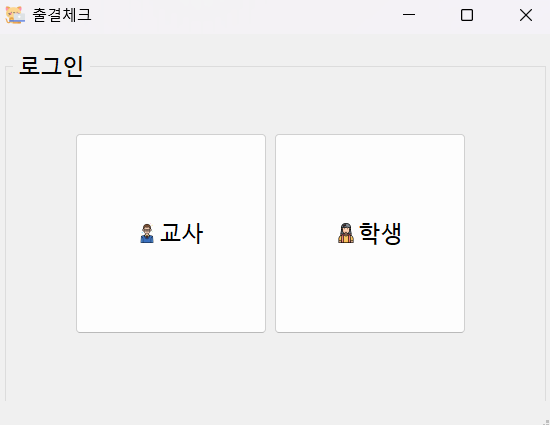
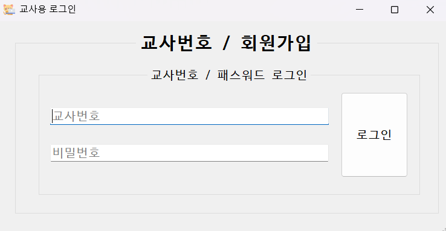
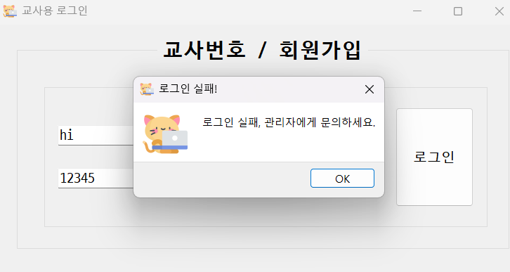
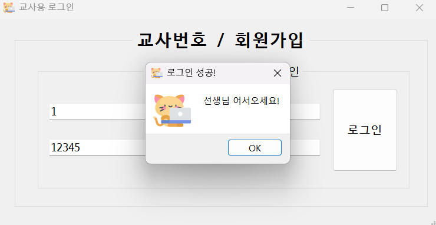
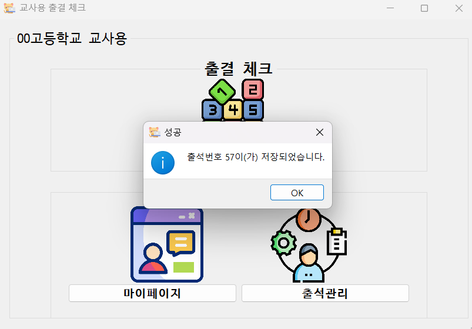
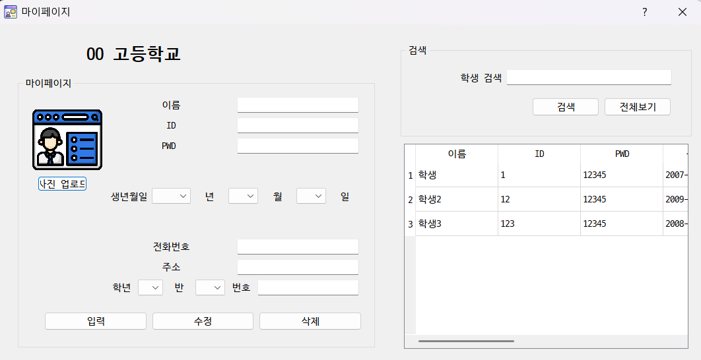
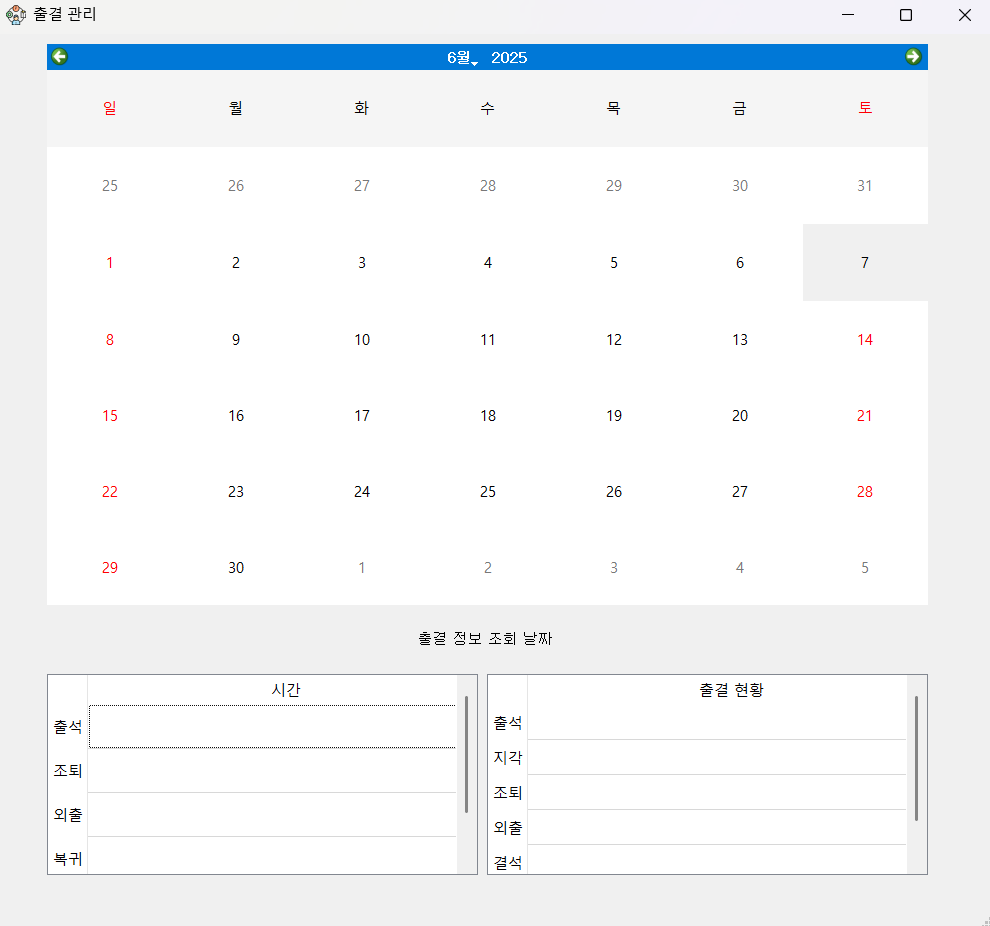
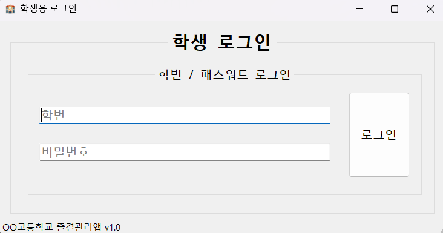
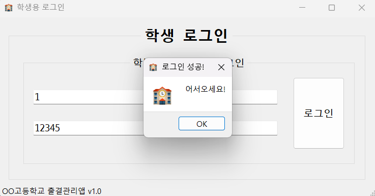
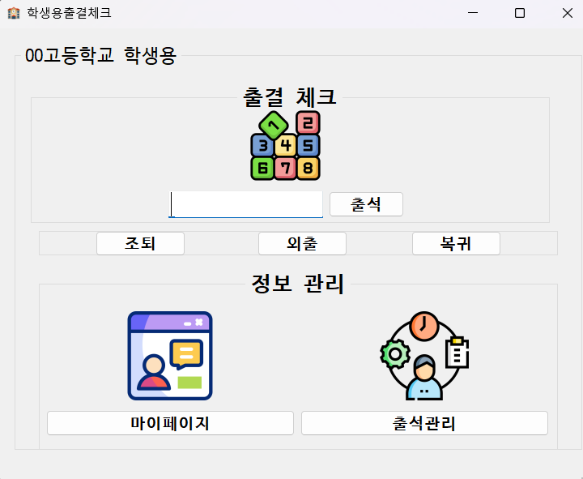

# 출석 관리 앱 (Attendance Management App)

## 프로젝트 설명

이 출석 관리 앱은 교사와 학생이 출석을 효율적으로 관리할 수 있는 시스템입니다. 교사는 출결번호를 생성하고, 학생은 이를 입력하여 출석을 체크할 수 있습니다. 로그인 화면부터 출결 관리까지 직관적인 UI와 기능을 제공합니다.

## 기능 소개

### 1. 로그인 선택 화면

앱 실행 시, 사용자는 교사 또는 학생을 선택하여 로그인 화면으로 이동합니다.

### 2. 교사용 로그인 화면

교사는 로그인 후, 출결번호를 생성하여 학생에게 배포하고 출결을 관리할 수 있습니다.

### 3. 교사용 로그인 - 로그인 실패 화면

로그인 실패 시, 해당 화면이 표시됩니다.

### 4. 교사용 로그인 - 로그인 성공 화면

로그인 성공 시, 교사의 대시보드로 이동하여 출결 관리 기능을 사용할 수 있습니다.

### 5. 교사용 로그인 - 출결번호 생성

교사는 출결번호 생성 버튼을 눌러 랜덤 번호를 발급하고, 학생은 해당 번호를 입력하여 출석을 체크합니다.

랜덤번호는 `checkno` 컬럼에 저장되어, 학생의 ID와 교사의 ID가 연결됩니다.

### 6. 교사용 로그인 - 마이페이지

교사는 마이페이지에서 출결 기록을 확인하고 관리할 수 있습니다.

### 7. 교사용 로그인 - 출결관리

교사는 출결 관리 화면에서 각 학생의 출결 상태를 관리할 수 있습니다.

### 8. 학생용 로그인 화면

학생은 교사가 제공한 출결번호를 입력하여 로그인하고 출석을 체크합니다.

### 9. 학생용 로그인 성공

로그인 성공 후, 학생은 출석 체크 화면으로 이동하여 자신의 출결 상태를 확인할 수 있습니다.

### 10. 학생용 로그인 - 출결 버튼

학생은 "조퇴", "외출", "복귀" 버튼을 눌러 각 출결 상태를 업데이트할 수 있습니다.

출결 상태는 각 버튼을 눌러 `외출`, `조퇴`, `복귀` 상태로 업데이트되며, 해당 정보는 출결 관리 페이지에 반영됩니다.

### 11. 학생 마이페이지

학생은 마이페이지에서 자신의 출결 기록을 확인할 수 있습니다.

### 12. 출결확인 페이지

출결 관리 화면에서 교사는 학생들의 출결 상태를 확인하고 관리할 수 있습니다.

